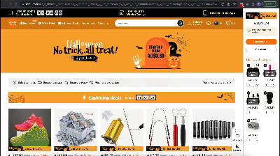

# Bara Guard
<div style="text-align: center;">
  
</div>

---


A Chrome Extension designed to detect and alert users to malicious dark patterns on websites. We've developed specialized algorithms to detect countdown timers, hidden information and similar color trick detectors aimed at deceiving users. The extension is designed to provide a safer, more informed browsing experience.

## Features
- Countdown Timer Detection: Detects artificial countdown timers used in manipulating user's purchasing decisions.
- Hidden Information Detection: Detects hidden charges, costs and any information concealed to deceive users.
- Similar Color Trick Detection: Essential for detecting camouflaged text, buttons or any other elements intentionally blending to the background, creating visual illusions.

## Structure
```
.
├── README.md
├── app.js
├── chrome
│   ├── README.md
│   ├── background.js
│   ├── capybara_team_coversheet.pdf
│   ├── content.css
│   ├── content.js
│   ├── education_website
│   ├── images
│   ├── manifest.json
│   ├── popup.html
│   ├── popup.js
│   ├── src
│   └── styles.css
├── package-lock.json
└── package.json
```

- `README.md`: This is the main README file for the project.
- `app.js`: This is the core file of backend ([Google document AI](https://cloud.google.com/document-ai?hl=en)).
- `chrome`: This directory contains all the files related to the Chrome extension.
    - `README.md`: This is the README file for the Chrome extension.
    - `background.js`: This is the background script for the Chrome extension.
    - `capybara_team_coversheet.pdf`: This is a PDF file for team coversheet.
    - `content.css`: This is a CSS file for the content scripts of the Chrome extension.
    - `content.js`: This is a JavaScript file for the content scripts of the Chrome extension.
    - `education_website`: This directory contains files related to an education website.
    - `images`: This directory contains image files used in the Chrome extension.
    - `manifest.json`: This is the manifest file for the Chrome extension.
    - `popup.html`: This is the HTML file for the popup of the Chrome extension.
    - `popup.js`: This is the JavaScript file for the popup of the Chrome extension.
    - `src`: This directory contains source files for the Chrome extension.
    - `styles.css`: This is a CSS file for the styles of the Chrome extension.
- `package-lock.json`: This is an automatically generated file based on the exact versions of your npm dependencies that were installed for your project.
- `package.json`: This file holds various metadata relevant to the project. This file is used to give information to npm that allows it to identify the project as well as handle the project's dependencies.


## Installation
1. Download this repository as a zip and extract or clone the repository.
2. Open the Chrome browser, go to `chrome://extensions`.
3. Enable the developer mode at the top right.
4. Click on `Load unpacked` and select the `Dark Pattern Detector` extension folder.
5. The extension should now be available for use in developer mode.

## Usage

<div style="text-align: center;">
  
</div>

Once installed, the extension will automatically run and analyze webpages you visit. You will be alerted via notifications whenever any malicious dark patterns are detected on the site.

## Contributions
We welcome contributions from the open source community. Please feel free to submit a Pull Request or open an issue for discussion. 

## License
MIT License

## Support
Please submit an issue on our Github page for any problems you encounter while using the extension. 

## Roadmap
Our future focus includes an expansion in the types of dark patterns, like miss-direction, and forced actions detection. The main goal is to provide a safer and more secure web experience for everyone.

---

Please remember when installing developer extensions that they have not been reviewed by the Chrome Web Store and can affect your Chrome browser's functionality. We highly recommend only using trusted and open source extensions. 

By contributing to this project, you agree to adhere to our code of conduct and our contribution guidelines.

Enjoy a safer browsing experience with Dark Pattern Detector!
